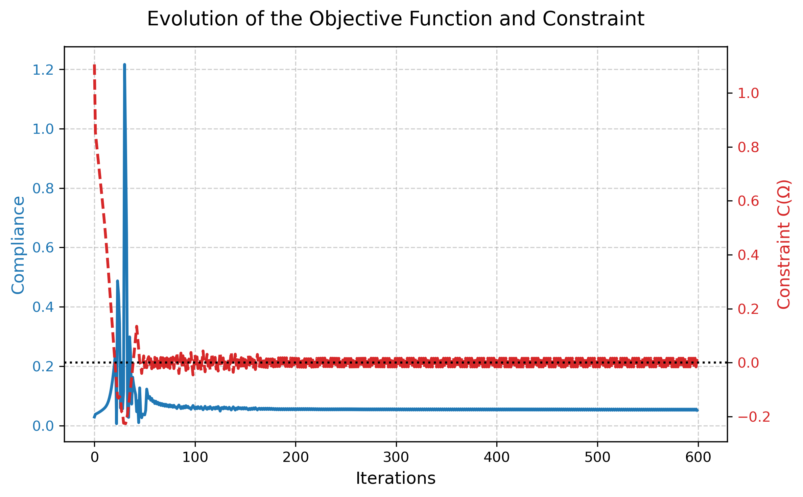

.. _demo3D:

3D Compliance Minimization
============================

This tutorial extends the 2D compliance minimization to a three-dimensional
cantilever beam and illustrates how OptiCut leverages MPI parallelism
through its `dolfinx` / PETSc backend.

Problem definition
---------------------

The shape optimization problem is identical in structure to the 2D case.
Find the domain :math:`\Omega \subset \mathbb{R}^3` that minimizes the
compliance functional subject to a volume constraint:

.. math::
    \begin{cases}
    \underset{\Omega\in\mathcal{O}}{\min}\ J(\Omega)
    = \int_{\Omega}\left(2\mu\,\varepsilon(u):\varepsilon(u)
      +\lambda\,(\nabla\cdot u)^2\right)dx\\[6pt]
    C(\Omega) = |\Omega| - \overline{V} = 0
    \end{cases}

The discretization employs the **Cut Finite Element Method** (CutFEM) with
Ghost Penalty stabilization. The displacement field
:math:`u_h` is sought on the background mesh :math:`\mathcal{T}_h`, with
integration restricted to the physical sub-domain :math:`\Omega_h = \{x \mid \phi(x) < 0\}`.
The stabilized bilinear form reads:

.. math::
    a_h(u_h, v_h)
    = \underbrace{\int_{\Omega_h}\!\bigl(2\mu\,\varepsilon(u_h):\varepsilon(v_h)
      + \lambda\,(\nabla\cdot u_h)(\nabla\cdot v_h)\bigr)\,\mathrm{d}x}_{\text{elasticity on cut domain}}
    +\underbrace{\gamma \sum_{F\in\mathcal{F}_h^{\Gamma}}\int_F h_F
      \,\left[\!\left[\nabla u_h\cdot n\right]\!\right]\cdot\left[\!\left[\nabla v_h\cdot n\right]\!\right]\,\mathrm{d}s}_{\text{Ghost Penalty}}
    = \int_{\Gamma_N} g\cdot v_h\,\mathrm{d}s

where :math:`\mathcal{F}_h^{\Gamma}` denotes the set of interior facets
cut by the interface, :math:`h_F` is the local cell diameter, and
:math:`\gamma = 10^{-5}(\mu + \lambda)` is the Ghost Penalty parameter.

Mesh & MPI Partitioning
~~~~~~~~~~~~~~~~~~~~~~~~

OptiCut relies on `dolfinx`'s built-in mesh distribution: when launched
with `mpirun`, the mesh is partitioned into sub-domains using SCOTCH
(dolfinx's default graph partitioner). Each MPI process owns a disjoint
subset of cells and the associated DOFs, communicating ghost-layer values
via PETSc's scatter operations.

The figures below show the partition of the 3D cantilever mesh for 2 and
4 MPI processes respectively.

.. list-table::
   :widths: 50 50
   :align: center

   * - .. figure:: images/demo_compliance_3D/2proc.png
          :width: 100%

          Mesh partitioning — 2 MPI processes.
     - .. figure:: images/demo_compliance_3D/4proc.png
          :width: 100%

          Mesh partitioning — 4 MPI processes.

Iterative Solver (GAMG)
~~~~~~~~~~~~~~~~~~~~~~~~

Direct LU factorization does not scale to large 3D problems due to memory
requirements. OptiCut therefore uses the Conjugate Gradient (CG) method
preconditioned by PETSc's Geometric-Algebraic Multigrid (GAMG) solver when
the parameter `linear_solver amg` is set. This is configured as follows:

.. code-block:: python

    if parameters.linear_solver == "amg":
        self.primal_solver.setType(PETSc.KSP.Type.CG)
        self.primal_solver.getPC().setType("gamg")
        self.primal_solver.setTolerances(rtol=1e-6)

Implementation
--------------

Two parameter files are provided for this tutorial:

- ``compliance_3D_coarse.txt``: coarse mesh with :math:`h = 0.1`.
- ``compliance_3D.txt``: finer mesh with :math:`h = 0.05` (54,243 DOFs).

Both are designed to run on a standard workstation without a cluster.
The remainder of this section focuses on the finer configuration.
The cantilever geometry is a box :math:`[0,2]\times[0,1]\times[0,1]`;
the left face is clamped (:math:`\Gamma_D`) and a downward traction is
applied at the centre of the right face (:math:`\Gamma_N`).

.. code-block:: text

    cost_func compliance
    mesh_case 3D
    lx 2
    ly 1
    lz 1
    h 0.05
    linear_solver amg
    target_constraint 0.4
    young_modulus 210000000000

Running in Parallel
-------------------

.. code-block:: bash

    mpirun -n 2 python3 main.py parameters/compliance_3D.txt

For the present mesh size (54,243 DOFs), 2 processes is the recommended
configuration (see performance analysis below).

Results
-------

.. raw:: html

    

        <video width="80%" autoplay loop muted controls style="border: 1px solid #ccc;">
            <source src="_static/compliance_3D.mp4" type="video/mp4">
        </video>
        

            Evolution of the level-set zero iso-surface over 600 iterations (h=0.05).
        

    

    Convergence history: compliance cost function (left axis, blue) and
    constraint :math:`C(\Omega)` (right axis, red) over 600 optimization iterations.
    The dashed black line marks the satisfied constraint (:math:`C(\Omega) = 0`).

Post-processing in ParaView:

1. Open ``src/res/results.xdmf``.
2. Apply a **Contour** filter on ``ls_func`` at isovalue :math:`\phi=0`
   to extract the structural boundary.
3. Apply a **Warp By Vector** filter on ``disp`` to visualize deformed
   configurations.

Performance Analysis
--------------------

The table below reports wall-clock times for 600 optimization iterations
on the :math:`h=0.05` mesh (54,243 DOFs total), measured on a standard
8-core workstation.

.. list-table:: Wall-clock time and parallel efficiency (600 iterations, h=0.05)
   :header-rows: 1
   :widths: 15 25 25 20

   * - Processes
     - DOFs / process
     - Wall-clock time
     - Speedup
   * - 1
     - 54,243
     - 5770.90 s (96.18 min)
     - 1.00×
   * - 2
     - ~27,100
     - 3765.94 s (62.77 min)
     - 1.53×
   * - 4
     - ~13,560
     - 3506.94 s (58.45 min)
     - 1.64×

The speedup from 1 to 2 processes (1.53×, parallel efficiency 76.5%) is
meaningful but sub-linear. The gain from 2 to 4 processes (1.07×) is
negligible. This behaviour is consistent with the known communication-to-
computation ratio in domain-decomposition methods: at ~13,500 DOFs per
process, the MPI synchronisation overhead — ghost-layer exchanges,
global reductions for norm computations, and Krylov communication —
becomes comparable to the local solve time. For parallel efficiency to
remain acceptable above 4 processes, the mesh size should be increased to
maintain at least ~20,000–50,000 DOFs per process.
